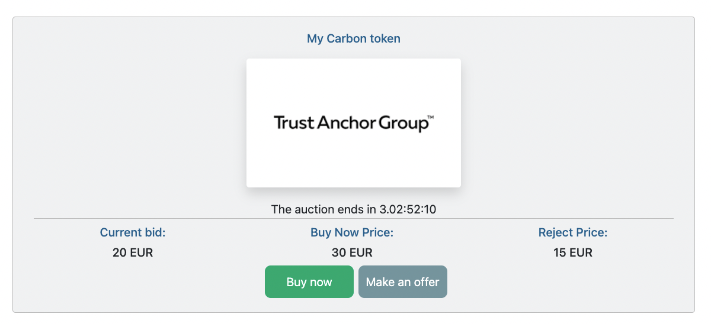
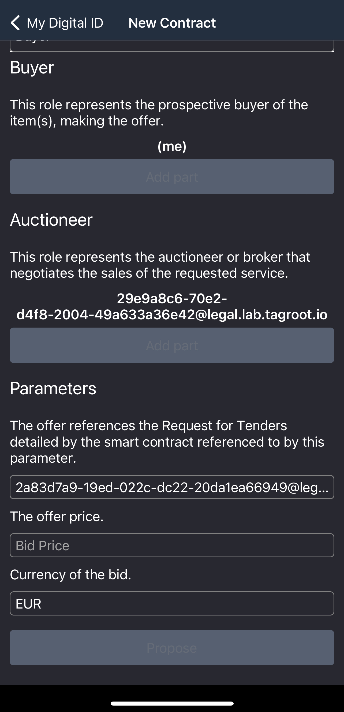

Title: How to | Make an offer
Description: more in depth information about a expecific Token.
Date: 2022-04-11
Author: Mateo Florez
Copyright: Copyright.md
Master: /Marketplace/src/Master.md
CSS: /Marketplace/src/css/marketplace.css
CSS: /Marketplace/src/Collections/Default/css/style.css

	<h5 class="display-6 fw-semibold border-bottom text-start">How do I make an offer on a Token?  Video Tutorial</h5>
	

	
1. First part

	
	
2. Second part

	
	

	<h5 class="display-6 fw-semibold border-bottom text-start">Text turorial<h5>
	

		

			
1. When you're on an item page, click the <strong>Make an offer</strong> button, scan the QR-code with your <strong>TAG ID app</strong> and follow the prompts.

			

				
			

			
2. Scroll to the bottom of the page and enter the amount of your offer

			

				
			

			
3. Click <strong>Propose</strong>. Now your offer is completed.

		

	

