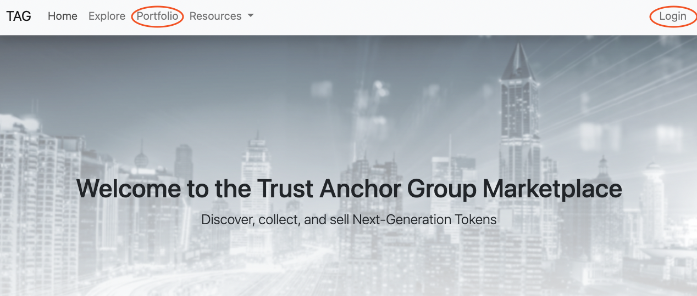
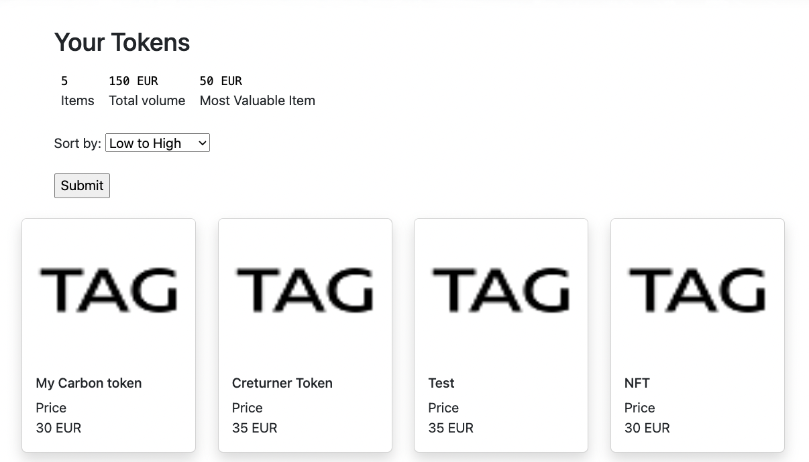
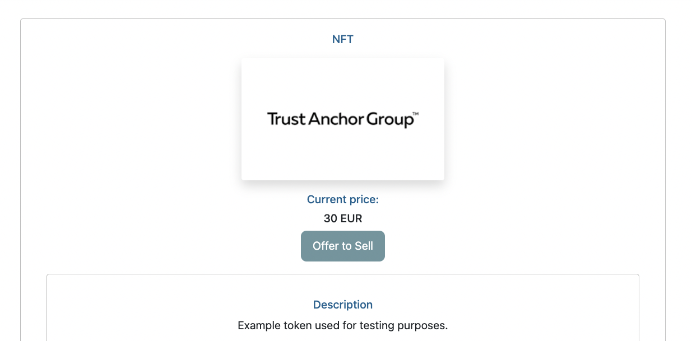
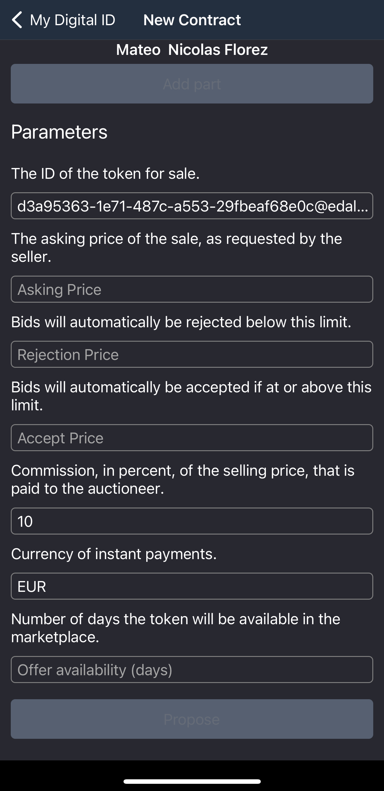
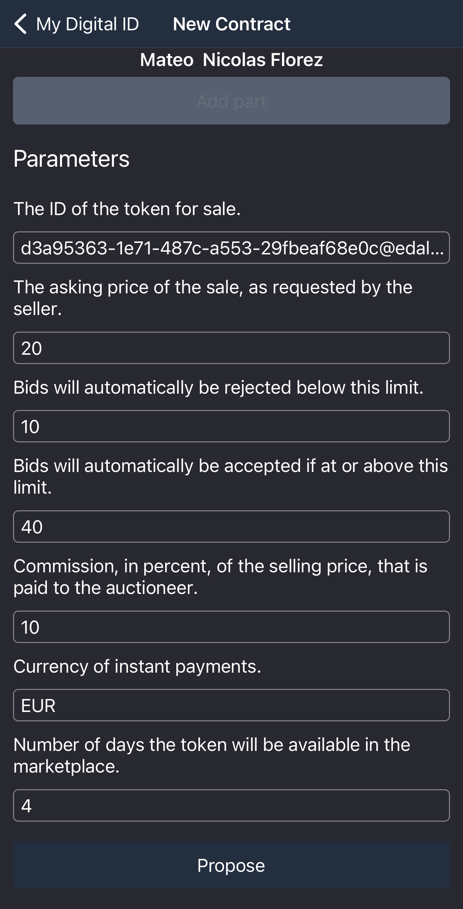

Title: How to | Sell a Token
Description: more in depth information about a expecific Token.
Date: 2022-04-11
Author: Mateo Florez
Copyright: Copyright.md
Master: /Marketplace/src/Master.md
CSS: /Marketplace/src/css/marketplace.css
CSS: /Marketplace/src/Collections/Default/css/style.css

	<h5 class="display-6 fw-semibold border-bottom text-start">How do I sell a Token?</h5>
	
There are two ways in which you can publish a Token for sale on the Marketplace, the first one is to use the Marketplace together with the TAG ID app.
	The second way is to only use the TAG ID application. Both ways are covered in this tutorial in the described order.
	

	

		<h5 class="text-start"> Selling using the Marketplace & the TAG ID application, <strong> Video Tutorial</strong></h5>
		
1. First part

		
		
2. Second part

		
		<h5 class="text-start mt-5"> Selling using the Marketplace & the TAG ID application, <strong> Text Tutorial</strong></h5>
		

			
1. On the TAG marketplace, navigate to the top right of the page and click <strong>Login</strong> you can also click <strong>Porfolio</strong> on the top left of the page and follow the prompts.

			

				
			

			
2. From the porfolio, select the Token you want to sell

			

				
			

			
3. Once on the item page, click the <strong>Offer to sell</strong> button. Scan the presented QR-code with the <strong>TAG ID</strong> app.

			

				
			

			
4. In the app, Scroll to the bottom of the page and fill in the parameters, <strong>Asking Price</strong>, <strong>Rejection Price</strong>, <strong>Accept Price</strong>, and <strong>Offer availability (days)</strong> 

			

				
			

			
5. Once the parameters are filled you can <strong>Propose</strong> the sell by clicking the propose button on the bottom of the page.

			

				
			

			
 If everything was done correctly your item should now be visible on the TAG marketplace

		

    

	

		<h5 class="text-start"> Selling using only the TAG ID application, <strong> Video Tutorial</strong></h5>
		<h5 class="text-start mt-5"> Selling only the TAG ID application, <strong> Text Tutorial</strong></h5>
		

		

    

